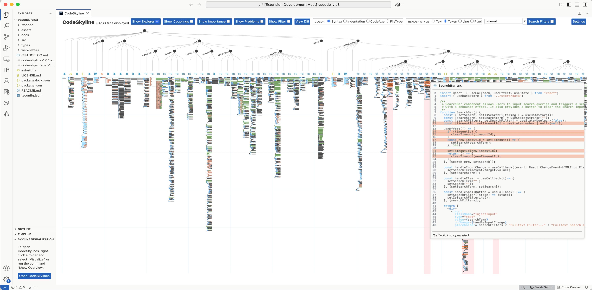

# CodeSkylines

This repository maintains the issue list for the VSCode Extension CodeSkylines.
It further contains the images for the README.

## Links

The extension is available on the VSCode marketplace: <https://marketplace.visualstudio.com/items?itemName=fraunhofer-igd.code-skyline>

For the online demo of the visualization tool check out: <https://codeskyline.iva.igd.fraunhofer.de/>
